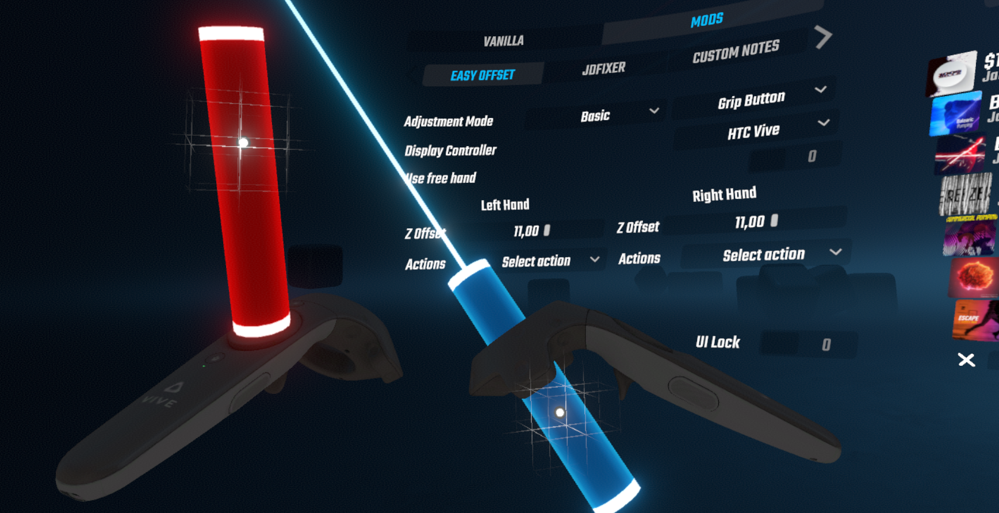
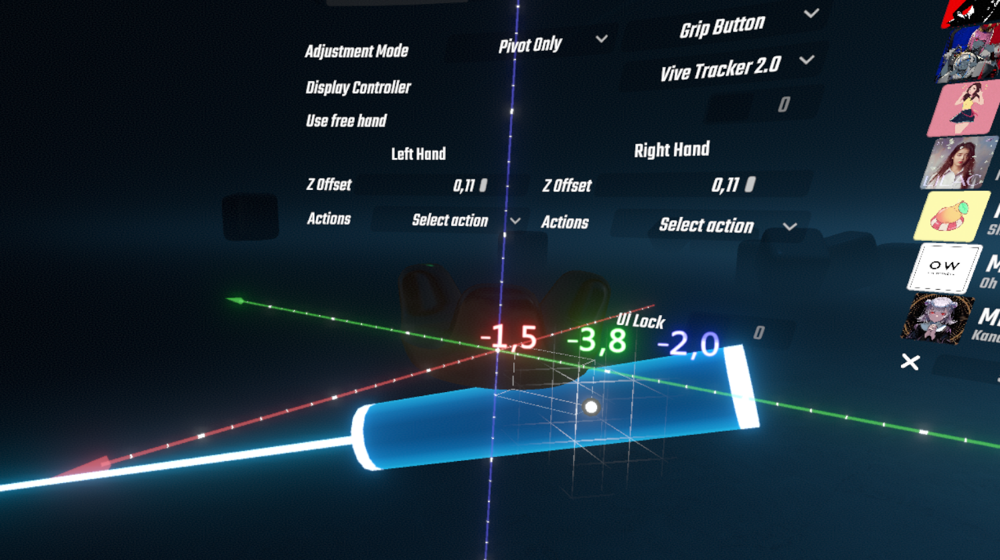
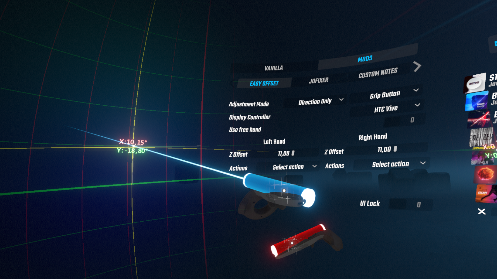

# Easy Offset
**Page is currently WIP**

This mod is **PC ONLY**! Quest version is planned, but not guaranteed

##Coming soon™
- Config import and export in .Json format

##Known issues
 - This mod is **PC ONLY**! Quest version is planned, but not guaranteed

#Description

Beat Saber mod for quick and easy controller offset adjustment. 
It allows you to see your controller in-game and use it as a reference. 
While it is intuitive for beginners, it has a lot of tools for advanced players

Adjustment process is extremely simple: push the button, move your hand, release the button

In this mod offset is defined by three config values for each hand:

- `Pivot point` - saber origin position relative to controller
- `Direction vector` - saber direction vector relative to `Pivot point`
- `ZOffset` - saber position offset along `Direction vector`

# How to install
- Install **BSIPA** and **BeatSaberMarkupLanguage** dependencies using
 [ModAssistant](https://github.com/Assistant/ModAssistant)
  
- Download latest .dll for your game version from the 
[Releases page](https://github.com/Reezonate/EasyOffset/releases)
and put it in `/plugins` directory inside your game folder

# How to use
Before trying to find your best config, spend some time in different modes and experiment with the tools at your disposal

First steps:
- Select your controller model in `DisplayController` list
- Choose a button you can press without changing your grip
- If there is no such button, check `Use Free Hand` toggle to use the button on the other hand

In order to get decent config, you have to achieve two goals:
- `Pivot point` should be stable as the wrist rotates. In other words - it should be aligned with your actual wrist pivot point as much as possible
- Saber trail shouldn't move in a huge circle while you pointing forward and rolling your wrist comfortably. The smaller the radius, the better

To help you achieve these goals, there are four adjustment modes:
- `Basic`
- `Pivot Only`
- `Direction Only`
- `Direction Auto`

## `Basic` adjustment mode:
Simple adjustment mode made for beginners and casual players
- Select `Basic` in `Adjustment Mode` list
- While holding the selected button, move your hand and pick up the saber in a new position by releasing the button

## `Pivot Only` adjustment mode:
Precise position adjustment mode

Allows you to change the `Pivot point` without changing the `Direction vector`

 - Select `Pivot Only` in `Adjustment Mode` list
 - Align the `Pivot point` with your wrist pivot point. You can see where it is relative to the controller IRL
 - World aligned 3D grid serves as a stationary reference to track `Pivot point` movement. 
   Keeping it in one cell regardless of wrist rotation is good enough
 - Displays `Pivot point` coordinates in centimeters

## `Direction Only` adjustment mode:
Precise swing adjustment mode for advanced players. Best used with `Use Free Hand` enabled

Allows you to change the `Direction vector` without changing the `Pivot point`

 - Select `Direction Only` in `Adjustment Mode` list
 - Move saber left or right for curved swing correction
 - Move saber up or down for underswing correction
 - Displays `Direction Vector` in spherical coordinates familiar to most players

## `Direction Auto` adjustment mode:
Automatic calculation of the `Direction vector` based on your movement. Great for getting initial values for a new grip, requires manual tweaking in `Direction Only` mode afterwards. 
Affects **ONLY** `Direction vector`, `Pivot point` remains intact

This is simple math, not magic, and result depends only on your motion while button is pressed. 
If you'd tape your controller to a car wheel, this mode will simply align saber with wheel axis. 
Sadly, it won't make your car hit 115s with perfect swing

- Select `Direction Auto` in `Adjustment Mode` list
- Push the button and start rolling your wrist left and right. 
  Not like you're cutting the block, but as if you are trying to drill a hole in it
- Hold button until trail movement is minimized. 2-3 seconds usually enough

## `Room Offset` adjustment mode:
World pulling locomotion in Beat Saber! This mode uses in-game room offset settings to move you around

- Select `Room offset` in `Adjustment Mode` list
- Hold button and move your hand
- you can reset offset in base game settings

Useful for quick floor level alignment. Just put one controller on the floor and use its model as a reference
