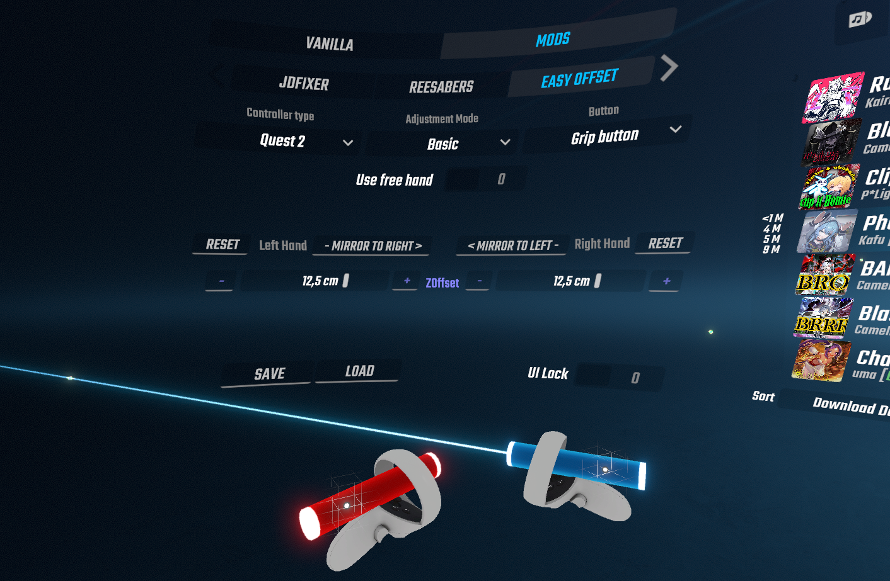
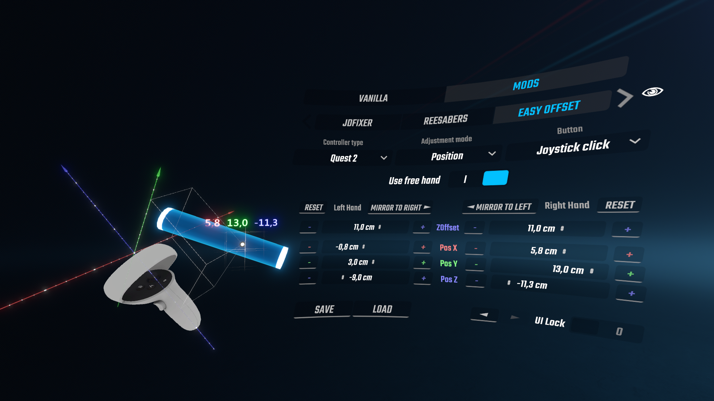
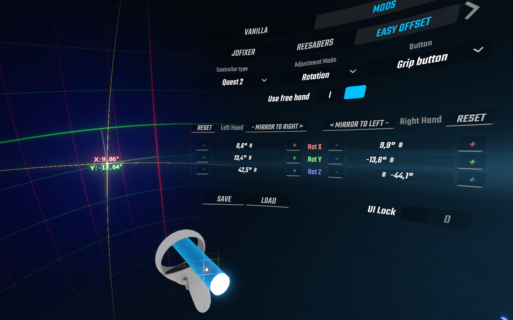
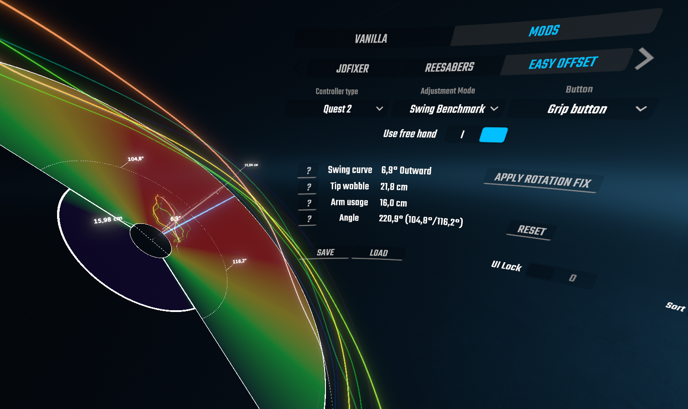
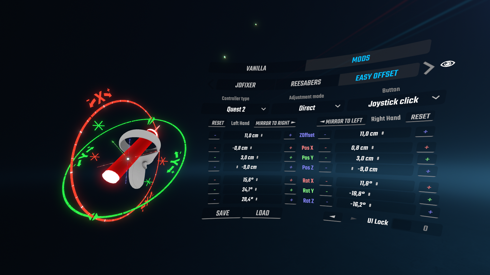

# Easy Offset

Beat Saber mod for intuitive controller offset adjustments. Suitable for both beginners and advanced players

- [How to use](#how-to-use)
- [Config migration](#config-migration)
- [Support the project](https://ko-fi.com/reezonate)

# Compatibility

- Partially compatible with SaberTailor (Grip modification should be turned off)
- Not compatible with other offset adjustment mods (e.g. ControllerSettingsHelper)
- Config values are different from the base game settings, SaberTailor, etc.
- **PC ONLY**! Quest version is planned, but not guaranteed
- Best used with [CustomMenuPointers](https://github.com/dawnvt/CustomMenuPointers)

# How to install
- Install **BSIPA** and **BeatSaberMarkupLanguage** dependencies using
  [ModAssistant](https://github.com/Assistant/ModAssistant)

- Download the latest .dll for your game version from the
  [Releases page](https://github.com/Reezonate/EasyOffset/releases)
  and put it in `/plugins` directory inside your game folder

# Config migration

## Import

### From the base game settings

- Go to `Settings` > `Mod Settings` > `Easy Offset`
- Use `Z Offset` slider to change the `Pivot Point` position (0 - top of the hilt, 17 - bottom of the hilt)
- Press the `Import from settings` button

### From SaberTailor mod

```diff
- SaberTailor.json file is required in the UserData directory
- World offset is not supported!
```

- Go to `Settings` > `Mod Settings` > `Easy Offset`
- Use `Z Offset` slider to change the `Pivot Point` position (0 - top of the hilt, 17 - bottom of the hilt)
- Press the `Import from SaberTailor` button
- Make sure to disable SaberTailor to avoid interference

## Export

### To the base game settings

```diff
- Per hand offset is not supported in the base game settings. Right hand offset will be used
```

- Go to `Settings` > `Mod Settings` > `Easy Offset`
- Press the `Export to settings` button
- Disable EasyOffset

### To SaberTailor mod

```diff
- Rotation values will be rounded to the nearest whole number of degrees
```

- Go to `Settings` > `Mod Settings` > `Easy Offset`
- Press the `Export to SaberTailor` button
- Disable EasyOffset
- Go to `Settings` > `Mod Settings` > `SaberTailor` > `Manage config profiles`
- Refresh profiles list and load `EasyOffsetExported` profile

# How to use
### Config values:

- `Pivot point` - saber origin position relative to the controller. Displayed as a white dot surrounded by a grid
- `Saber Rotation` - saber rotation euler angles
- `ZOffset` - saber position offset along its axis

Config values are different from the base game settings, SaberTailor, etc. 
Use the [Config Migration](#config-migration) settings to plug these values in

### First steps:
- Select your controller model in the `Controller Type` list
- Choose a button you can press without changing your grip
- If there is no such button, check the `Use Free Hand` toggle to use the button on the other hand

Before trying to find your best config, spend some time in different adjustment modes and experiment with the tools at your disposal

### To get a decent config, you have to achieve two goals:

- `Pivot point` should be stable as the wrist rotates. In other words - it should be aligned with your actual wrist pivot point as much as possible
- Saber trail shouldn't move in a huge circle while you pointing forward and rolling your wrist comfortably. The smaller the radius, the better

To help you achieve these goals, there are four main adjustment modes:

- [Basic](#basic-adjustment-mode)
- [Position](#position-adjustment-mode)
- [Rotation](#rotation-adjustment-mode)
- [Swing Benchmark](#swing-benchmark-adjustment-mode)
- [Direct](#direct-adjustment-mode)

## `Basic` adjustment mode:
``` diff
+ Easy: Suitable for any skill level
```
Simple drag and drop adjustment mode

- Select `Basic` in the `Adjustment Mode` list
- Press the selected button, move your hand to a new position, release the button
- You can move the saber along its axis using the `ZOffset` slider



## `Position` adjustment mode:
``` diff
+ Easy: Suitable for any skill level
```
Position only adjustment mode. Displays `Pivot point` coordinates in centimeters

Allows you to change the `Pivot point` without changing `Saber Rotation`

- Select `Position` in the `Adjustment Mode` list
- Align the `Pivot point` with your wrist pivot point. You can see where it is relative to the controller IRL
- You can move the saber along its axis using the `ZOffset` slider 

World-aligned 3D grid serves as a stationary reference to track `Pivot point` movement. Keeping it in one cell regardless of wrist rotation is good enough


## `Rotation` adjustment mode:
``` diff
- Advanced: An understanding of how the saber rotation affects your swing is required
```

Rotation only adjustment mode. Displays `Saber Rotation` on a spherical grid. Best used with the `Use Free Hand` enabled

Allows you to change the `Saber Rotation` without changing the `Pivot point`

- Select `Rotation` in the `Adjustment Mode` list
- Change your controller orientation while holding the button 
- You can raise your free hand to zoom in for greater precision

### To use `Rotation` mode to its full potential, you need to first set a `Reference`

Setting a `Reference` gives you ability to independently change your `Curve` and `Balance` values (Horizontal / Vertical rotation)

- Go to the [Swing Benchmark](#swing-benchmark-adjustment-mode) mode, perform swing test and press the `Set as Reference` button (for each hand)
- After that you'll be able to use `Balance` and `Curve` sliders
- Changing the `Balance` value will point your saber Up or Down
- Changing the `Curve` value will point your saber Inward or Outward

By default `Reference` is aligned with the calculated straight swing plane. You can then align it with your current settings by pressing the `Update` button



## `Swing Benchmark` adjustment mode:
``` diff
- Advanced: Requires developed technique and ability to full swing
```
Gives you objective measurements of your swing. Use for config and grip analysis. Best used with `Use Free Hand` enabled

Results will gradually change from vertical to horizontal swing. Optimize your config for a diagonal swing, unless you know what you're looking for

- Select `Swing Benchmark` in the `Adjustment Mode` list
- Repeat one exact swing several times while holding the button
- Stand still, look forward, and swing exactly as you do in-game
- Do **NOT** swing in front of you, put your hand to the side as you do in-game
- Swing angle of at least 140° is required


Note that due to swing inconsistencies, the suggested "Auto-fix" may not be perfect

Calculation error mostly depends on a `Tip wobble` (smaller is better) and `Angle` (higher is better). The more repeatable your swings are, the more precise result you'll get

After the successful test, you can use the calculated straight swing plane as a reference for the `Rotation` mode



### `Swing Curve` measurement
Indicates how straight your swing is

- Negative values mean that your saber is pointing too much inwards (to the center)
- Positive values mean that your saber is pointing too much outwards (away from the center)
- Values around zero mean that your swing is perfectly straight

How to improve:

- You can reduce it manually in the `Rotation` mode
- You can reduce it automatically by pressing the `Apply rotation fix` button. This action will change your config, backup if you're not sure!
- Straight swing requires fairly wide hand placement, which may feel uncomfortable at first if you had a big outward curve

### `Tip Wobble` measurement
Indicates how much tip of your saber deviates from the plane.

One of the main accuracy limiting factors. You have only 2 cm of margin to score 115 consistently, (2+3) cm for 114, (2+6) cm for 113, etc. (assuming you have no underswing, no time dependency, and always aim for the center)

- If it is caused by the 8-shaped swing, you have poor weight balance with your grip
- If your swing is not repeatable at all, you have to practice more and optimize your technique

How to improve:

- You can remove it only by changing your grip to a weight-balanced one
- You can reduce it by using more arm at a stamina cost
- Work on your technique: make your swings as smooth and slow as possible
- Stretching regularly will help reduce wobble at the limiting angles

### `Arm Usage` measurement
Indicates how much the hilt of your saber moves during the swing

Preference, optimize to your play style

- Higher arm usage requires a lot of stamina and significantly limits your speed capabilities
- Lower arm usage increases wobble, limiting your accuracy

### `Angle` measurement
Indicates how much angle is covered by your swing. Also shows your backhand and forehand angles (relative to the horizontal plane)

- According to the game scoring system, you need at least a 100° pre-swing angle and a 60° post-swing angle. Note that these values are relative to the block (e.g. bottom lane up-swing requires a much greater forehand angle than the top lane up-swing)

How to improve:

- If you are constantly under-swinging a certain direction, change the forehand/backhand angle balance by rotating the saber up/down in the `Rotation` mode
- Regular stretching will help increase the range of motion in your wrist

## `Direct` adjustment mode:
``` diff
- Expert: Deep understanding of each config value is required
- It is not recommended to use someone else's settings
```
Mode for changing raw config values directly

Values are different from the base game settings, SaberTailor, etc.
Use the [Config Migration](#config-migration) settings to plug these values in

- Select `Direct` in the `Adjustment Mode` list
- Click on slider and hold the trigger to change its value (The longer you hold it, the faster the value changes)
- Use the opposite hand to see the changes in real time, otherwise the change will only be applied when the trigger is released
- Use increment/decrement buttons for the tiny adjustments



# Extra features

## `Rotation Auto` adjustment mode:
``` diff
- Expert: An understanding of what a good config looks like is required. The result may not be optimal
- Config-breaking: Drastically changes your config. Save the preset to have a backup
```

Automatic calculation of the `Saber Rotation` based on your movement. Great for getting initial values for a new grip, requires manual tweaking in `Rotation` mode afterward.
Affects only rotation, doesn't change the position values

- Select `Rotation Auto` in the `Adjustment Mode` list
- Point forward, press the button, and start rotating your wrist as you do when turning a doorknob
- Hold the button until trail movement is minimized. 2-3 seconds usually enough
- Fine-tune using `Swing Benchmark` and `Rotation` modes

The result depends only on your motion while a button is pressed. Make sure to choose the most comfortable rotation axis

## `Room Offset` adjustment mode:
``` diff
+ Easy: suitable for any skill level
```
World pulling locomotion in Beat Saber! This mode uses base game room offset settings to move you around

- Select `Room offset` in the `Adjustment Mode` list
- Hold the button and pull or push the world around you
- To move only vertically, disable X and Z axles
- To move only horizontally, disable Y axis

Useful for getting consistent player height. Disable an in-game auto height calculation and use your preferred hmd Y position as a reference for future tweaks
